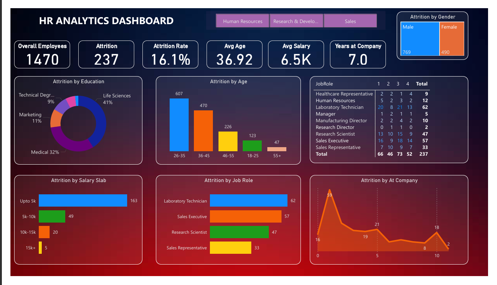

# HR Analytics Dashboard - Power BI

## Project Overview
The **HR Analytics Dashboard** is a Power BI project designed to analyze employee attrition and workforce data.  
This dashboard helps HR teams understand the key factors that influence employee turnover and workforce trends.

The goal of this project is to provide meaningful insights using data visualization so organizations can make better HR decisions.

---

## Dashboard Preview

---

## Visualizations Included

### 1. Attrition by Education
Shows employee attrition based on educational background such as:
- Life Sciences
- Medical
- Marketing
- Technical Degree

### 2. Attrition by Age
Displays attrition distribution across age groups:
- 18–25  
- 26–35  
- 36–45  
- 46–55  
- 55+

### 3. Attrition by Salary Slab
Analyzes employee attrition across different salary ranges.

### 4. Attrition by Job Role
Shows which job roles experience the highest attrition such as:
- Laboratory Technician
- Sales Executive
- Research Scientist
- Sales Representative

### 5. Attrition by Gender
Compares attrition rates between male and female employees.

### 6. Attrition by Years at Company
Displays how employee attrition changes with experience in the company.

---

## Tools & Technologies Used
- Power BI Desktop
- Data Visualization
- HR Analytics Dataset
- Microsoft Excel / CSV Dataset

---

## Project Files
- `HR_Analytics_Dashboard.pbix` → Power BI dashboard file  
- `dataset.csv` → Dataset used for analysis  
- `dashboard.png` → Dashboard preview image  
- `README.md` → Project documentation  
- `BG12.jpg` → Background image
---

## How to Use
1. Download the `.pbix` file from this repository.
2. Open it using **Microsoft Power BI Desktop**.
3. Explore the interactive HR analytics dashboard.

---

## Learning Outcomes
Through this project, I learned:
- Data cleaning and preparation
- Data visualization using Power BI
- Creating interactive dashboards
- HR data analysis

---

## Author
**Rohan Kumar Raj**
